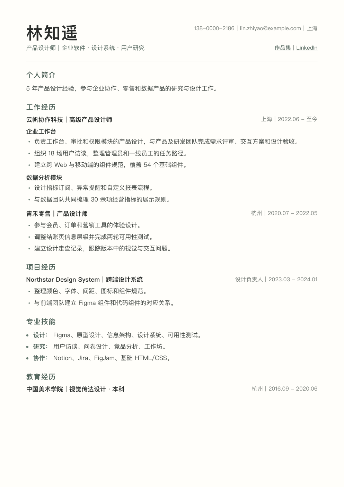
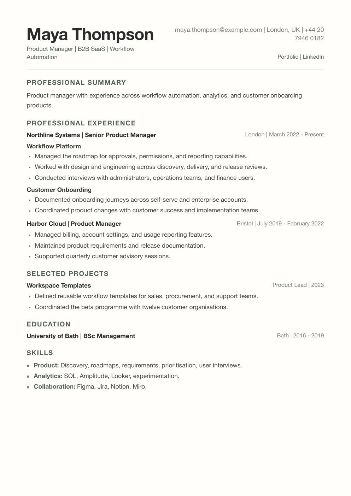

<div align="center">

# ResumeMD

**Give an AI agent your resume materials. Get polished Markdown and PDF.**

[](https://github.com/beholder91/resume-md-skill/actions/workflows/ci.yml)
[](LICENSE)
[](https://www.python.org/)
[](#limitations)

[中文](README.md) · [Examples](examples) · [Contributing](CONTRIBUTING.md)

</div>

> Markdown is the easiest document format for working with LLMs, yet ordinary Markdown-to-PDF output rarely looks good. ResumeMD provides a Chinese-first, naturally paginated, deterministic resume renderer.

ResumeMD is a local Skill for AI agents such as Codex and Claude Code. The agent reads PDF, DOCX, image, text, or Markdown input and converts it faithfully. ResumeMD performs only deterministic rendering: it calls no LLM and uploads nothing.

<table>
  <tr>
    <th align="center">中文</th>
    <th align="center">English</th>
  </tr>
  <tr>
    <td></td>
    <td></td>
  </tr>
</table>

## Ask your agent to install it

Paste this into Codex or Claude Code:

```text
Install this project as a global Skill and complete one rendering self-test:
https://github.com/beholder91/resume-md-skill
```

Then ask naturally:

```text
Create a Chinese resume PDF from ./resume.pdf
Format ./profile.docx as an English resume without changing the content
Re-render ./resume.md with serif headings
```

The Skill writes `resume-output/<name>.md` and
`resume-output/<name>.pdf` by default. It asks before guessing when source
content is ambiguous.

## Manual plugin installation

### Codex

```bash
codex plugin marketplace add beholder91/resume-md-skill
codex plugin add resume-md@resume-md
```

### Claude Code

```bash
claude plugin marketplace add beholder91/resume-md-skill
claude plugin install resume-md@resume-md
```

Renderer-only installation:

```bash
git clone https://github.com/beholder91/resume-md-skill
python3 resume-md-skill/plugins/resume-md/skills/resume-md/scripts/install.py
~/.local/bin/resume-md doctor
```

The installer creates an isolated virtual environment and renders a real smoke-test PDF. Linux/WSL downloads pinned Noto Sans/Serif SC fonts on demand and verifies their SHA-256 checksums.

## CLI

```bash
resume-md render resume.md \
  --output resume.pdf \
  --language auto \
  --style auto \
  --json
```

Options:

- `--language auto|zh-CN|en`
- `--style auto|sans|serif|hybrid`
- `--font-size 10.5`
- `--json`

Run `resume-md doctor` to check Python, Pango, fonts, and real PDF rendering.

## How it works

```text
PDF / DOCX / image / text
          │ agent extraction and faithful conversion
          ▼
    structured Markdown
          │ local deterministic rendering
          ▼
 PDF/UA + embedded fonts + natural pagination
```

- Format contracts define structure only; they never polish, translate, or invent content.
- WeasyPrint handles A4 layout and semantic pagination.
- Output text remains extractable, safe links remain clickable, and fonts are embedded.
- A CFF compatibility pass prevents Chinese font corruption in Apple Preview.
- Six fictional Chinese and English fixtures render on both macOS and Ubuntu CI.

## Privacy

Local-only, no account, no upload, no telemetry, and no built-in LLM call. Inputs and outputs stay in paths chosen by the user.

## Limitations

Version 0.1 supports macOS, Linux, and WSL. Native Windows, portraits, multi-column themes, and cloud services are out of scope. ResumeMD never forces a one-page layout by shrinking type or deleting content.

## Development

```bash
python3 -m venv .venv
.venv/bin/pip install -e 'plugins/resume-md[dev]'
.venv/bin/pytest -q
```

ResumeMD uses the [MIT License](LICENSE). Downloaded Noto fonts use the
[SIL Open Font License 1.1](plugins/resume-md/licenses/OFL-1.1.txt); see
[Third-party notices](THIRD_PARTY_NOTICES.md).
